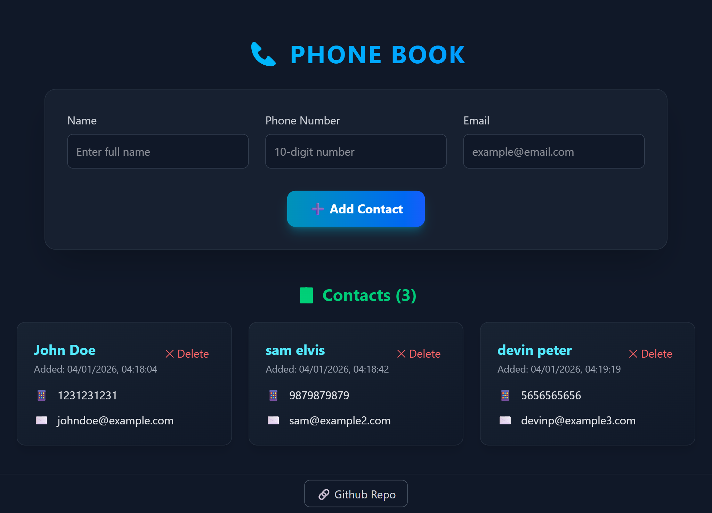
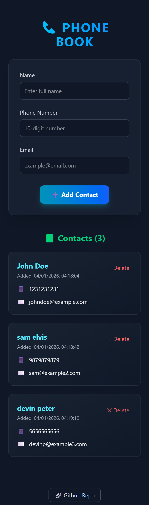

# Contact Card - Phone Book Application

## 🌐 Live Demo
[](https://contact-card-olive.vercel.app/)

## Project Preview

### Desktop View


### Mobile View



## Project Overview
A modern contact management application built with React and Tailwind CSS. Manage your phone contacts with a clean, responsive interface featuring real-time validation and intuitive controls.

## Tech Stack

**Frontend:** React 19 | JavaScript ES6+  
**Build Tool:** Vite | npm  
**Styling:** Tailwind CSS  
**Deployment:** Vercel


## Key Features
- Form validation for name, email, and 10-digit phone number
- Dark theme UI with gradient accents and glassmorphism effects
- Responsive grid layouts for mobile and desktop
- Add/delete contacts with immediate visual feedback
- Automatic creation time tracking for each contact
- Secure external links with proper attributes

## How It Works
1. **Form Submission**: Fill in name, email, and phone number fields
2. **Validation**: Real-time validation ensures all fields are properly filled
3. **Contact Creation**: Each contact gets a unique ID and timestamp
4. **Contact Management**: View all contacts in responsive grid, delete as needed
5. **Responsive Layout**: Adapts to different screen sizes automatically
6. **Dynamic Height**: Adjusts layout based on number of contacts

## Components Structure
- **Contact.jsx** - Main contact manager component with form and contact list
- **Footer.jsx** - Footer with GitHub repository link
- **App.jsx** - Layout wrapper with proper spacing

## Learning Outcomes
- Building React applications with functional components
- Form handling and validation in React
- State management with useState hook
- Responsive design implementation with Tailwind CSS
- Array manipulation for CRUD operations
- Component composition and props management
- Deploying React apps to GitHub Pages

## Setup Instructions

### Prerequisites
- Node.js (version 16 or higher)
- npm or yarn package manager

### Installation
```bash
# Clone the repository
git clone https://github.com/shekgit/contact-card.git

# Navigate to project directory
cd contact-card

# Install dependencies
npm install

# Start development server
npm run dev
```

## Build for Production
```bash
# Create production build
npm run build

# Preview production build
npm run preview
```
## Deployment
Deployed on **Vercel** with automatic CI/CD. Every push to main branch triggers a new deployment.

## Project Structure
```
contact-card/
├── src/
│   ├── components/
│   │   ├── Contact.jsx
│   │   └── Footer.jsx
│   ├── App.jsx
│   ├── main.jsx
│   └── index.css
├── public/
├── index.html
├── vite.config.js
├── package.json
└── README.md
```

## Responsive Breakpoints
Desktop: 1024px and above (three-column grid)

Tablet: 768px - 1023px (two-column grid)

Mobile: Below 768px (single column, stacked layout)

## Performance Features
- Optimized React component structure
- Efficient state updates
- CSS transitions for smooth animations
- Lightweight Tailwind CSS utility classes
- Proper semantic HTML structure

## License
MIT License - free to use for educational and personal projects